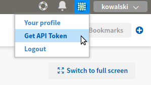

Minimal example
===============

Below is the smallest possible example that follows the theme: *from zero to first Neptune experiment*.

Register
--------
Go here: https://neptune.ml/register *(registration is free of charge)*.

Copy API token
--------------
``NEPTUNE_API_TOKEN`` is located under your User menu (top right side of the screen, like on the image below):

Assign it to the bash environment variable:

.. code:: bash

    export NEPTUNE_API_TOKEN='YOUR_LONG_API_TOKEN'

or append this line to your ``~/.bashrc`` or ``~/.bash_profile`` files **(recommended)**.

.. warning:: Always keep your API token secret - it is like password to the application. It is recommended to append "export" line to your ``~/.bashrc`` or ``~/.bash_profile`` files.

Install neptune-client
----------------------

.. code:: bash

    pip install neptune-client

Run Python script
-----------------
Save script below as ``start.py`` and run it like any other Python file: ``python start.py``. Will see link to the experiment printed to the standard output.

.. code:: Python

    import neptune

    # pick project, provide API token
    neptune.init('USERNAME/PROJECT_NAME')

    # create experiment
    neptune.create_experiment()

    # send some metrics
    n = 117
    for i in range(1, n):
        neptune.send_metric('iteration', i)
        neptune.send_metric('loss', 1/i**0.5)

    neptune.set_property('n_iterations', n)
    neptune.stop()

Congrats! You just ran your first Neptune experiment and checked results online.

.. note:: What did you just learn? Few concepts:

    * how to run Neptune experiment
    * how to track it online
    * how to use basic Neptune client features, like *create_experiment()* and *send_metric()*

What next?
----------
Go to Larger-example to learn more about `Neptune client <https://github.com/neptune-ml/neptune-client>`_ and its capabilities.
