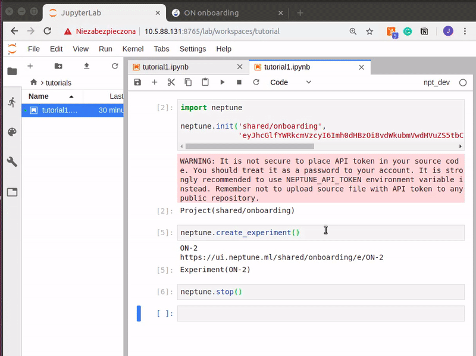

Session and Experiment
======================
Session and experiment are two core concepts behind neptune-client. This tutorial guides you through them and explains how to work with them.

Session
-------
In the first tutorial, as you remember, we initialized Neptune using *neptune.init*:

.. code-block::

    import neptune

    neptune.init('USERNAME/PROJECT_NAME')
    ...

However, full definition of the *neptune.init* is like this:

.. code-block::

    neptune.init(project_qualified_name='USERNAME/PROJECT_NAME',
                 api_token='YOUR_LONG_API_TOKEN')

* ``project_qualified_name`` - this is *USERNAME/PROJECT_NAME*, where first component is organization name and second is project name (as you created in the Neptune web application).
* ``api_token`` - User can explicitly paste ``NEPTUNE_API_TOKEN`` here, however, **it is not recommended**. This method first look for environment variable, then value passed here. Note that this value overwrites environment variable.

.. note:: If you have your API token stored in the ``NEPTUNE_API_TOKEN`` environment variable you can leave the ``api_token`` argument empty.

That is not the only way of doing it but does make things simpler. If you want to have more control you can explicitly start neptune session:

.. code-block::

    from neptune.sessions import Session

    session = Session(api_token='YOUR_LONG_API_TOKEN')

The session object lazily contains all of the projects that you have access too. You can fetch the project on which you want to work on by running:

.. code-block::

    project = session.get_project(project_qualified_name='USERNAME/PROJECT_NAME')

And create a new experiment in that project.

.. code-block::

    experiment = project.create_experiment()

Returned ``experiment`` lets you invoke all methods that you know from the previous tutorial, for example:

.. code-block::

    experiment = project.create_experiment()

    experiment.send_metric('iteration', i)
    experiment.send_metric('loss', 1/i**0.5)
    experiment.set_property('n_iterations', 117)

Experiment
----------

Let's dive into the **create_experiment** method and what you can track with it.
As you remember in the minimal example we started an experiment, logged something to it, and stopped it:

.. code:: Python

    neptune.create_experiment()
    neptune.send_metric('auc', 0.93)
    neptune.stop()

You can make it cleaner and create your experiments in **with statement** blocks:

.. code-block::

    with neptune.create_experiment() as exp:
        exp.send_metric('auc', 0.93)

By doing that you will never forget to stop your experiments. We recommend you use this option.
Also, if you are creating more than one experiment, this approach keeps things civil.

Ok, now that we know how to start and stop experiments let's see what happens in the app when you actually run it.

With every **create_experiment** a new record is added to Neptune with a state *running*.
When you run **stop** on your experiment, either explicitly or implicitly, the state is changed to *succeeded*.
